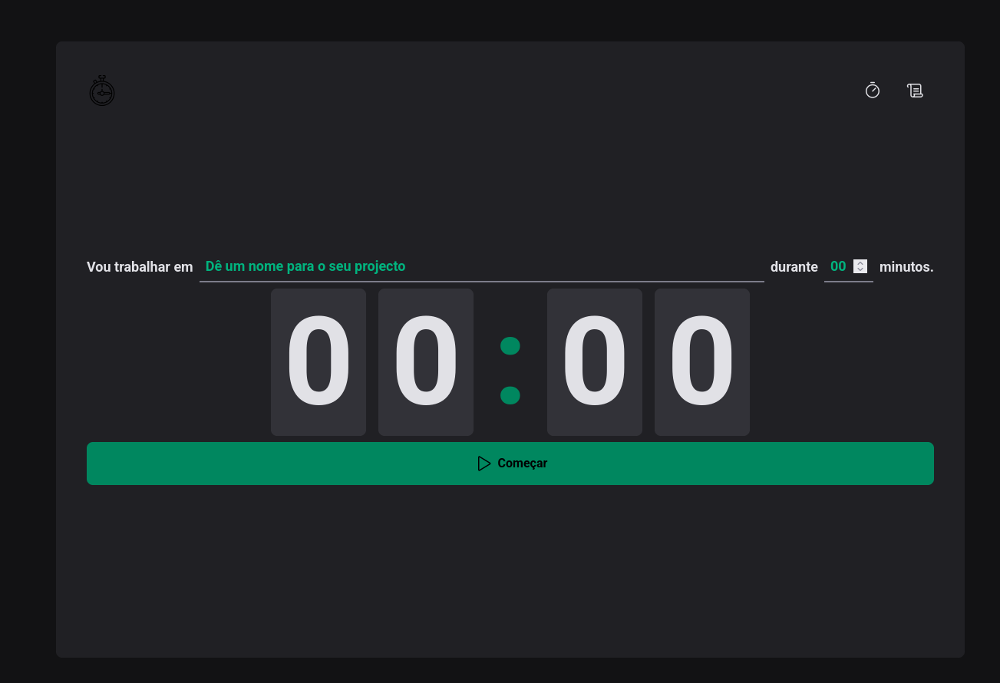

# 🕑 App Pomodoro


Uma aplicação de **Pomodoro Timer** desenvolvida com **React.js** para fins **estudantis**, com o objetivo de praticar conceitos de **React, Styled Components, Hooks e React Hook Form**. A aplicação ajuda a organizar o tempo de estudo ou trabalho utilizando a técnica Pomodoro, com interface limpa e responsiva.

---

## 🎬 Preview

  

---

## 📌 Funcionalidades

- Timer Pomodoro configurável (25 min foco / 5 min descanso por padrão)  
- Ciclos automáticos de foco e descanso  
- Notificações visuais ao término de cada ciclo  
- Interface limpa e responsiva  
- Customização do tempo de foco e descanso  
- Formulários gerenciados com **React Hook Form**

---

## ⚙️ Tecnologias

- **React.js** – Biblioteca principal para construção da UI  
- **Styled Components** – Estilização de componentes com CSS-in-JS  
- **ESLint** – Padronização de código  
- **React Hooks** – useState para gerenciamento de estado  
- **React Hook Form** – Gerenciamento de formulários  

---

## 🚀 Instalação

1. Clone o repositório:

```bash
git clone https://github.com/teu-usuario/app-pomodoro.git
cd app-pomodoro
npm install
npm run dev
```
## 🛠️ Uso

- Clique em **Iniciar** para começar o Pomodoro de foco.  
- O timer contará o tempo de trabalho definido.  
- Ao terminar, o timer notificará para iniciar o período de descanso.  
- Você pode **pausar** ou **reiniciar** o timer a qualquer momento.  
- Ajuste o tempo de foco e descanso através do formulário gerenciado pelo **React Hook Form**.

## 🧹 Contribuição

Projeto criado para fins **estudantis**, mas contribuições são bem-vindas!

Para contribuir:

1. Faça um fork do projeto  
2. Crie uma branch (`git checkout -b minha-feature`)  
3. Faça commit das alterações (`git commit -m 'Minha nova feature'`)  
4. Push para a branch (`git push origin minha-feature`)  
5. Abra um Pull Request

@Obrigado...
